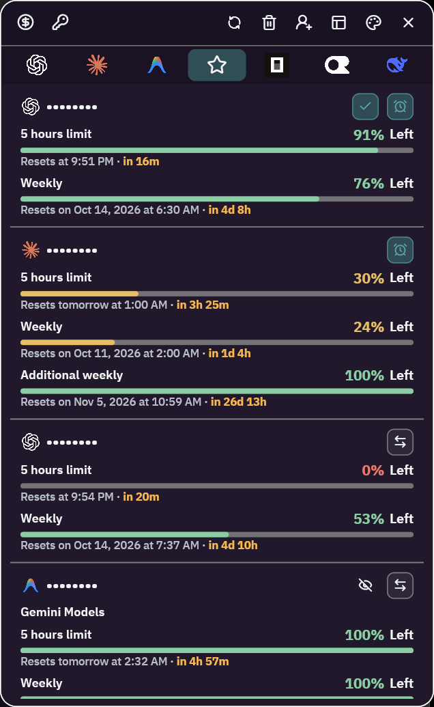
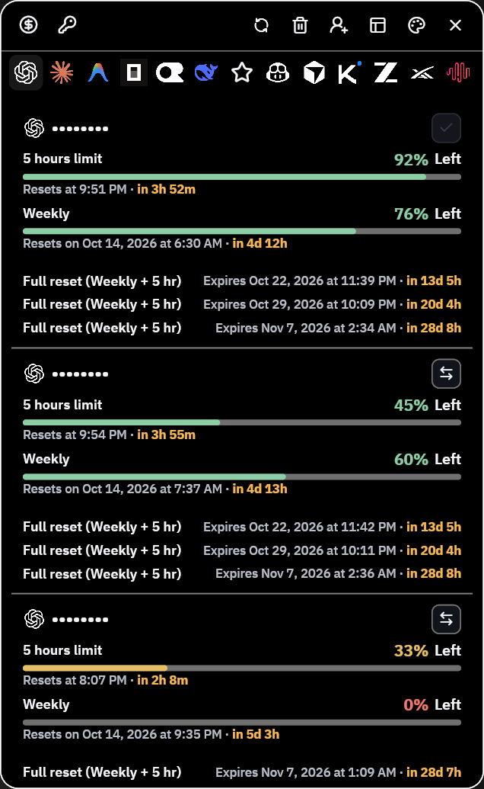
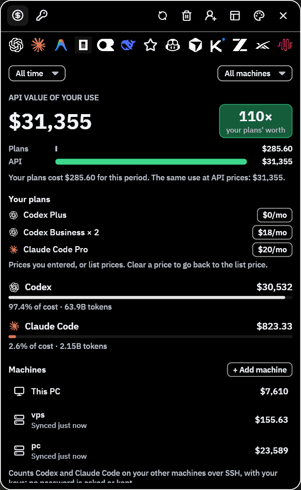
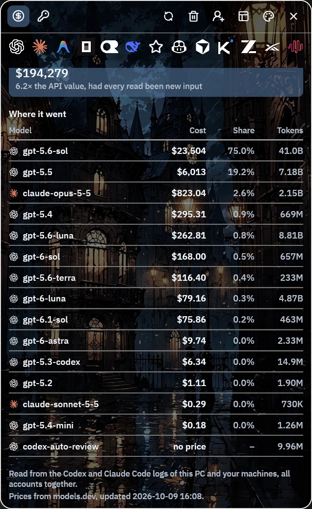
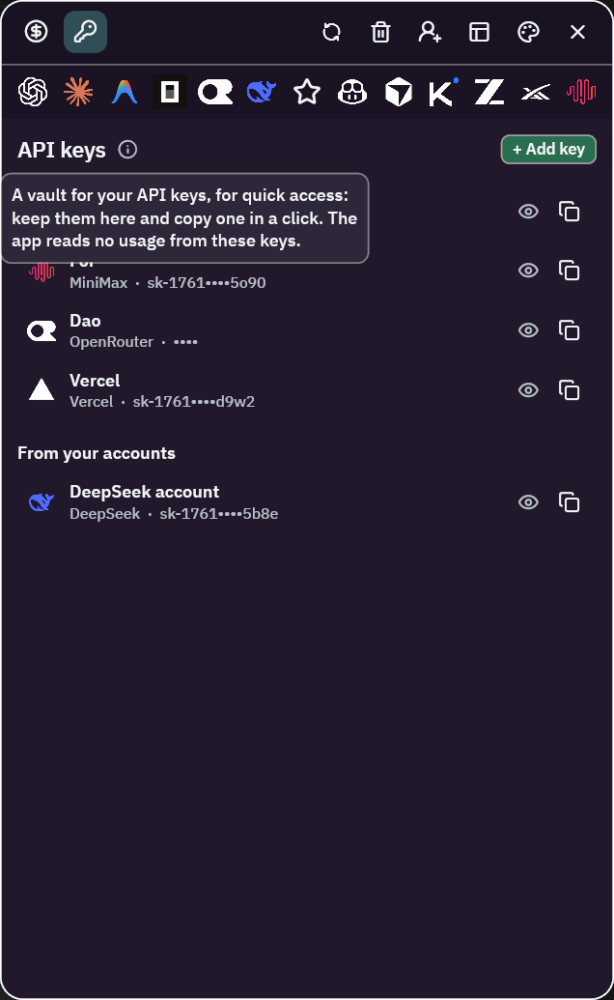
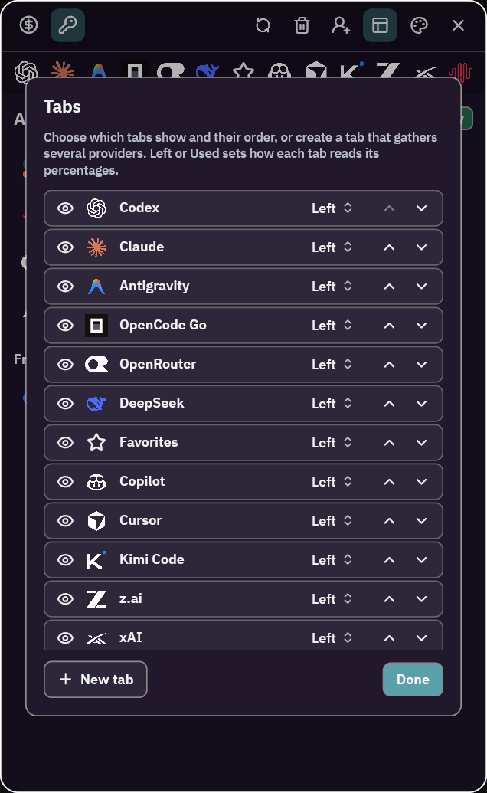
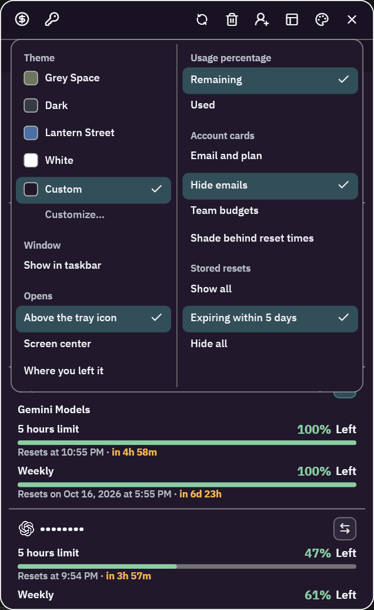

# AI Usage Tray

**See every AI subscription limit from the Windows tray: Codex (ChatGPT),
Claude Code, Antigravity, GitHub Copilot, Cursor, and more, across all your
accounts, with the 5-hour and weekly resets.**

[](https://github.com/onsiyan/AIUsageTray/releases/latest)
[](https://github.com/onsiyan/AIUsageTray/releases)
[](https://github.com/onsiyan/AIUsageTray/actions/workflows/ci.yml)


[](LICENSE)

<p align="center">
  
</p>

<p align="center">
  <a href="https://github.com/onsiyan/AIUsageTray/releases/latest"><b>Download the latest setup</b></a>
  &nbsp;·&nbsp; free and open source &nbsp;·&nbsp; about 13 MB
</p>

AI Usage Tray tracks AI subscription usage across several accounts and
providers from one Windows tray popup: Codex (ChatGPT Plus, Pro, and
Business), Claude (Pro and Max, as used by Claude Code), Antigravity,
GitHub Copilot, Cursor, OpenCode Go, Kimi Code, z.ai, MiniMax, OpenRouter,
DeepSeek, and xAI. It shows each account's session, weekly, and model limits
with their reset times, reset credits, and plan, or the prepaid balance, and
can switch the Codex and Antigravity desktop apps to any saved account.

**Why use it**

- One glance instead of opening each provider's settings page: how much of
  every 5-hour and weekly limit is left, and when it resets.
- Built for people with several accounts: personal and work, or more than
  one plan per provider.
- Switch accounts in one click: the Codex and Antigravity desktop apps move
  to any saved account and restart on it, so a used-up limit is one click
  from a fresh one.
- Starts the next 5-hour window right after a reset, through the official
  `codex` or `claude` CLI, so no hours are lost waiting for your first message.
- Shows what your Codex and Claude Code use would cost at API prices, against
  what you pay for the plans.
- Light: a native Rust app that gives its memory back to Windows while the
  popup is hidden. Sign-ins stay in Windows Credential Manager and go only
  to the providers themselves.

## Features

- **Tray popup**: left-click the icon to open it. One tab per provider, plus
  Favorites and your own tabs that gather several providers or single
  accounts (Tabs button in the title bar).
- **Quick account switching** (the arrows on Codex and Antigravity cards):
  signs the Codex or Antigravity desktop app in with that account and
  restarts it; a check marks the account the app uses now (details under
  Accounts and sign-in, below).
- **Start the 5-hour window at reset** (the alarm clock on Codex and
  Claude cards): a 5-hour window only starts counting at your first message
  after a reset. With the alarm on, right after the window resets the
  official `codex` or `claude` CLI sends one word, so the next window starts
  at once. It works while the popup is hidden, only when that CLI is signed
  in with the same account, and the app itself never sends anything.
- **Tray menu**: right-click the icon to open the popup or the Cost page,
  refresh every account, turn Start with Windows on or off, open the log
  folder, or quit.
- **Updates**: the app checks GitHub for a newer release at start and once
  a day, and offers its page in the tray menu and the popup.
- **Cost page** (the $ button): what Codex and Claude Code use would cost at
  API list prices, read from their local session logs, against what your
  plans cost. History is kept past the tools' own clean-up, by day, model,
  and tool, and can include other machines reached over SSH with your keys.
- **API keys page** (the key button): keep any service's API key, picked
  from 60 AI companies' logos, copy it in one click, or test it with one
  free request to the service (18 services, OpenAI to OpenRouter). Keys
  stay in Windows Credential Manager; the page reads no usage from them.
- **Themes**: built-in dark, light, and picture themes, or your own colors
  and background picture.
- **Where it opens**: above the tray icon, in the middle of the screen, or
  where you left it (palette menu).
- **Hide emails**: every email shows as dots, for screenshots (palette
  menu).
- **Command line**: `ai-usage-tray-cli` for people and agents, with stable
  account references and JSON output.

## Screenshots

| | | |
|:---:|:---:|:---:|
|  |  |  |
| Every account's limits and resets | What your use would cost at API prices | The same, by model |
|  |  |  |
| API keys, one click to copy | Your own tabs and their order | Themes and display options |

## Install

Download `AIUsageTray-<version>-Setup.exe` from
[Releases](https://github.com/onsiyan/AIUsageTray/releases/latest) and run
it. The setup is not code-signed, so Windows SmartScreen may stop it the
first time: choose **More info**, then **Run anyway**. Setup installs for
the current Windows user without an administrator prompt (by default into
`%LOCALAPPDATA%\Programs\AIUsageTray`) and lets you choose the folder,
starting with Windows, and a desktop shortcut. Running a newer setup updates
the app in place; remove it from Windows' Installed apps, which asks whether
to remove your saved accounts, keys, and settings too.

## FAQ

**How do I check my Codex or Claude Code usage limit on Windows?**
Install the app, add the account (the add-account button in the title bar;
each provider signs in through its own page), and click the tray icon. Each
card shows the 5-hour and weekly limits left and when they reset.

**Can it track several ChatGPT or Claude accounts at once?**
Yes. Add as many accounts per provider as you have; each gets its own card,
and Favorites or your own tabs can gather them in one place.

**Does it read my browser cookies or send my data somewhere?**
No. It only uses sign-ins you add in the app, keeps them in Windows
Credential Manager, and sends them only to each provider's own servers. The
only other request is the daily update check on GitHub. See `SECURITY.md`.

**Why does Windows warn about the setup?**
The setup is not code-signed yet. Choose **More info**, then **Run anyway**.

## Details

Click a title to open it.

<details>
<summary><strong>Repository layout</strong></summary>

```
apps/
  desktop/              Tray app (iced) — the product users run
  cli/                  ai-usage-tray-cli: account and usage commands for people and agents
  login/                ai-usage-tray-login: per-provider sign-in flows run by the CLI
crates/
  core/                 Provider-neutral accounts, OAuth, storage, refresh, and provider adapters
  platform-windows/     Credential Manager and desktop-app integration
```

`usage-monitor-core` holds everything that is not Windows-specific:
account/usage contracts, the HTTP transport, OAuth with PKCE and loopback
callbacks, SQLite storage, the provider adapters, and the refresh coordinator
(coalesced per-account flights, bounded concurrency, a 30-minute cadence,
reset-boundary refreshes, and last-good snapshot retention).

</details>

<details>
<summary><strong>Getting started</strong></summary>

Requires Windows and the Rust toolchain pinned in `rust-toolchain.toml`.

```powershell
cargo build --workspace --release
.\target\release\ai-usage-tray.exe
```

The desktop app, CLI, and sign-in helper must sit in the same directory; the
app runs the CLI to add accounts, and the CLI runs the sign-in helper. To build
the setup, install [Inno Setup 6](https://jrsoftware.org/isinfo.php)
(`winget install JRSoftware.InnoSetup`) and run
`apps/desktop/packaging/windows/build-installer.ps1`; it writes
`target/dist/AIUsageTray-<version>-Setup.exe`.

</details>

<details>
<summary><strong>Command line</strong></summary>

```powershell
.\target\release\ai-usage-tray-cli.exe account add codex --alias "Personal"
.\target\release\ai-usage-tray-cli.exe account add claude
.\target\release\ai-usage-tray-cli.exe account add antigravity
.\target\release\ai-usage-tray-cli.exe account add opencode-go
.\target\release\ai-usage-tray-cli.exe account add openrouter --api-key-stdin
.\target\release\ai-usage-tray-cli.exe account list
.\target\release\ai-usage-tray-cli.exe usage get ch1 --json
.\target\release\ai-usage-tray-cli.exe usage refresh --all --provider codex --json
.\target\release\ai-usage-tray-cli.exe usage watch
.\target\release\ai-usage-tray-cli.exe account remove ch1 --yes
.\target\release\ai-usage-tray-cli.exe reset --yes
```

Accounts have stable references: `chN` (Codex), `ccN` (Claude), `agN`
(Antigravity), `ocN` (OpenCode Go), `orN` (OpenRouter), `cpN` (Copilot),
`cuN` (Cursor), `kmN` (Kimi), `zaN` (z.ai), `mxN` (MiniMax), `dsN`
(DeepSeek), and `xaN` (xAI). They survive
restarts and renames and are never reused. An exact alias, label, or email also
selects an account; `--provider` or `--workspace` disambiguates.

`--json` writes one object with `schema_version: 1` to stdout and sends progress
to stderr. Exit codes: 2 invalid arguments, 3 no matching account, 4 ambiguous
selector, 5 removal not confirmed, 6 failed or partial refresh, 1 other errors.
`usage get` refreshes before returning; if the provider fails, the last good
snapshot is returned marked stale. `usage watch` refreshes every account every
30 minutes, and again right after each known window reset, until stopped.
`account remove` deletes local data and saved credentials but does not revoke
provider access. `reset` removes every saved account, key, and setting, as
uninstalling can.

</details>

<details>
<summary><strong>Accounts and sign-in</strong></summary>

| Provider | Sign-in | Usage source |
|---|---|---|
| Codex | OpenAI OAuth + PKCE, localhost callback (port 1455, fallback 1457) | WHAM usage API with the account's workspace id |
| Claude | Claude OAuth + PKCE, localhost callback | OAuth usage API, profile for identity and plan |
| Antigravity | Google OAuth + PKCE | Cloud Code APIs (models, grouped quota summary, project and tier) |
| OpenCode Go | OpenCode Console device authorization | Console (the Zen Go API for an OpenCode API key) |
| OpenRouter | API key (optional management key) via environment or stdin | `/key`, `/credits`, `/activity` |
| GitHub Copilot | GitHub device code | Copilot quotas (premium requests, chat) |
| Cursor | The Cursor app signed in on this computer, or a pasted session cookie | Cursor usage and on-demand spend |
| Kimi Code | API key (`KIMI_CODE_API_KEY` or stdin) | 5-hour, weekly, and monthly quotas |
| z.ai | API key (`Z_AI_API_KEY` or stdin) | GLM Coding Plan quotas |
| MiniMax | Coding Plan API key (`MINIMAX_CODING_API_KEY` or stdin) | Coding Plan quotas and points |
| DeepSeek | API key (`DEEPSEEK_API_KEY` or stdin) | `/user/balance` |
| xAI | Management API key and team ID | Prepaid balance and spend |

Every credential is scoped to one local account and is only read from that
account's Credential Manager entry (or Codex's `auth.json` while that account
is linked to Codex, below); environment variables, CLI sessions, and browser
cookies are never read on their own; a Cursor session cookie is used only when
you paste it.

### Switching the desktop apps

The desktop app can sign the Codex or Antigravity desktop app in with a saved
account and restart it:

- **Codex** reads its sign-in from `%USERPROFILE%\.codex\auth.json`. OpenAI
  refresh tokens are single use, so the account is *linked* rather than
  copied: while linked, `auth.json` is the source of truth, the monitor picks
  up rotations Codex made and writes its own back, and it uses Codex's valid
  access token instead of refreshing. Signing in to another account inside
  Codex ends the link. Switching is refused when Codex keeps its sign-in in the
  OS keyring.
- **Antigravity** keeps its sign-in in the Credential Manager entry
  `gemini:antigravity`. Saved accounts use the same Google OAuth client and
  Google refresh tokens do not rotate, so the token is simply written there.

An existing sign-in that does not belong to a saved account is backed up before
it is replaced.

</details>

<details>
<summary><strong>Data and credentials</strong></summary>

| What | Where |
|---|---|
| Accounts and usage history (no secrets) | `%LOCALAPPDATA%\UsageMonitor\accounts.db` |
| OAuth refresh credentials | Credential Manager `UsageMonitor/OAuth/<account-id>` |
| API keys and console sessions | Credential Manager `UsageMonitor/Auth/<account-id>` |
| Codex link and `auth.json` backups | `%LOCALAPPDATA%\UsageMonitor\` |
| Desktop preferences | `%APPDATA%\UsageMonitor\` |
| Kept API keys | Credential Manager `UsageMonitor/Vault/<id>` |
| Error log (no secrets) | `%LOCALAPPDATA%\UsageMonitor\logs\` |

Credentials larger than Credential Manager's 2,560-byte limit are split across
`#partN` entries. Access tokens live only in memory. Data written under the
earlier `CodexUsageMonitor-Rust` and `UsageMonitorPreview` names is moved to the
locations above the first time it is read. Pass `--database PATH` to any CLI
command to use another database.

</details>

<details>
<summary><strong>Development</strong></summary>

```powershell
cargo fmt --all -- --check
cargo clippy --workspace --all-targets -- -D warnings
cargo test --workspace
```

Continuous integration runs the same checks on Windows for every push and pull
request (`.github/workflows/ci.yml`). See `SECURITY.md` for how credentials are
handled and how to report a vulnerability, and `CHANGELOG.md` for changes.

To measure delivery of desktop refresh results on Windows, explicitly run:

```powershell
cargo test --workspace --release live_refresh_latency -- --ignored --nocapture
```

This diagnostic contacts the providers for the locally saved accounts and
updates their stored snapshots. It reports cold and warm delivery times using
account references, without printing credentials, and is excluded from normal tests.

</details>

## License

AI Usage Tray is released under the [MIT License](LICENSE). Provider names
and logos belong to their owners; see
`apps/desktop/assets/providers/ATTRIBUTION.md`.
